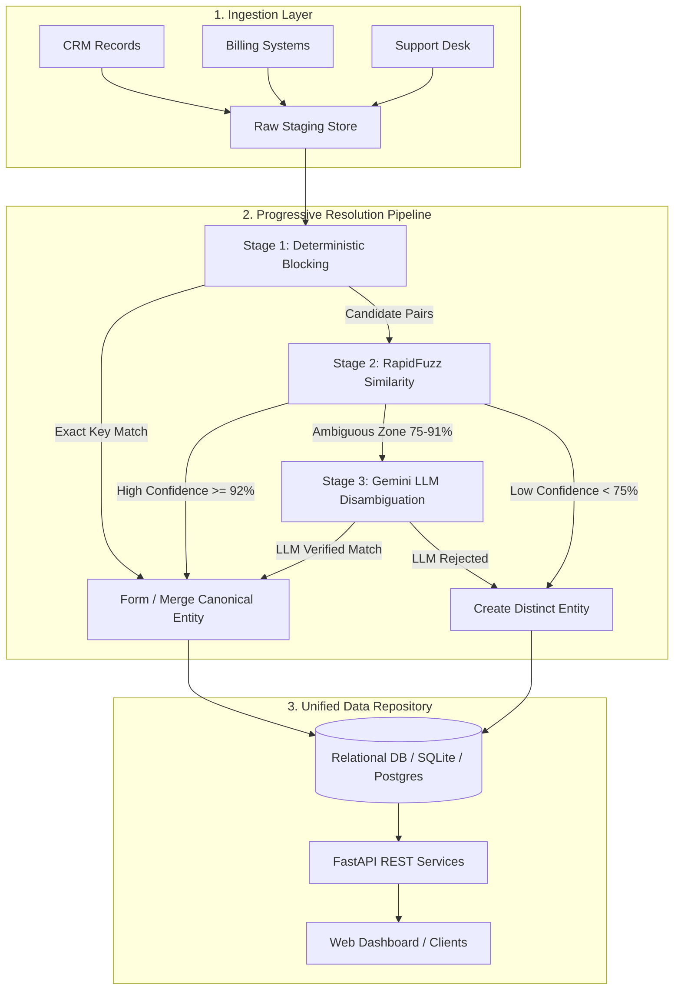

# Unified Progressive Entity Resolution & Data Repository (PRJ-07)

[](#)
[](#)
[](#)
[](#)

A high-throughput, progressive entity resolution and record linkage repository. Designed to ingest disparate, noisy records across distributed operational systems, progressively resolve real-world entities through multi-tier matching algorithms, and persist a single source of truth (canonical "golden" entities).

---

## 1. System Architecture

The system implements a **Progressive Resolution Pipeline** that maximizes throughput and matching accuracy while minimizing compute costs:



### The 3 Matching Tiers:
1. **Deterministic Blocking (Tier 1):** Exact matching on normalized immutable identifiers (normalized email, tax ID, phone hashes) for instant $O(1)$ resolution.
2. **RapidFuzz Token Similarity (Tier 2):** High-speed Levenshtein, Token Sort Ratio, and Partial Ratio calculations over normalized entity attributes (names, addresses, business titles).
3. **Google Gemini Semantic Disambiguation (Tier 3):** Leverages `google-genai` (Gemini 2.5 Flash) with structured semantic prompts to arbitrate borderline candidates (e.g. distinguishing between family members at the same address vs. name variations).

---

## 2. Directory Structure

```
entity-resolution-project/
├── backend/
│   ├── routes/             # FastAPI API sub-routers (health, entities, resolution)
│   ├── services/           # Resolution engine, Gemini LLM service, mock data generator
│   ├── tests/              # Pytest test suite
│   ├── main.py             # FastAPI entrypoint, middleware, lifespan
│   ├── database.py         # SQLAlchemy engine, session maker, get_db dependency
│   ├── models.py           # SQLAlchemy ORM models (RawRecord, CanonicalEntity, etc.)
│   ├── schemas.py          # Pydantic v2 schemas and validation DTOs
│   ├── config.py           # Environment variable loader (DATABASE_URL, GEMINI_API_KEY)
│   └── requirements.txt    # Project dependencies
├── frontend/               # Single-page monitoring dashboard
│   ├── index.html          # Modern dark-mode visualization interface
│   └── README.md           # Frontend documentation
├── data/                   # Data directory for benchmarks and sample records
│   ├── .gitkeep
│   └── sample_records.json # Disparate mock records for pipeline demonstration
├── run_demo.py             # End-to-end execution script
├── .env.example            # Environment configuration template
├── .gitignore              # Git ignore rules for virtualenvs, caches, secrets
└── README.md               # Master system documentation
```

---

## 3. Getting Started

### 3.1 Prerequisites
- Python 3.10+
- Git

### 3.2 Environment Setup
1. Clone the repository and enter the directory:
   ```bash
   cd c:\SMA-2
   ```

2. Create and activate a virtual environment:
   ```powershell
   python -m venv .venv
   .venv\Scripts\Activate.ps1
   ```

3. Install backend dependencies:
   ```bash
   pip install -r backend/requirements.txt
   ```

4. Configure environment variables:
   Copy `.env.example` to `.env` and configure your credentials:
   ```bash
   cp .env.example .env
   ```
   Edit `.env`:
   ```dotenv
   GEMINI_API_KEY="your-gemini-api-key"
   DATABASE_URL="sqlite:///./app.db"
   ```

---

## 4. Running the Demo & Server

### 4.1 Run the Progressive Resolution Pipeline Demo
Run the standalone demonstration script to ingest sample records from `data/sample_records.json` and perform progressive matching:
```bash
python run_demo.py
```

### 4.2 Start the FastAPI Backend
Launch the backend REST API with live reloading:
```bash
uvicorn backend.main:app --reload --port 8000
```
- Interactive API Documentation (Swagger): [http://localhost:8000/docs](http://localhost:8000/docs)
- Alternative API Documentation (ReDoc): [http://localhost:8000/redoc](http://localhost:8000/redoc)
- System Health Endpoint: [http://localhost:8000/api/health](http://localhost:8000/api/health)

### 4.3 Open the Web Dashboard
Open `frontend/index.html` in your browser or run a lightweight HTTP server:
```bash
python -m http.server 3000 --directory frontend
```
Navigate to [http://localhost:3000](http://localhost:3000).

---

## 5. Running Tests

Execute the automated test suite using `pytest`:
```bash
pytest backend/tests -v
```

---

## 6. Architecture & Security Specifications
- **Data Isolation:** All database secrets and API keys are isolated via `backend/config.py` and excluded from version control in `.gitignore`.
- **Database Scalability:** SQLAlchemy abstraction enables zero-code transition from SQLite to enterprise PostgreSQL or MySQL via `DATABASE_URL`.
- **LLM Safety:** Semantic disambiguation prompts enforce strict structured JSON schema responses to prevent non-deterministic parsing anomalies.
